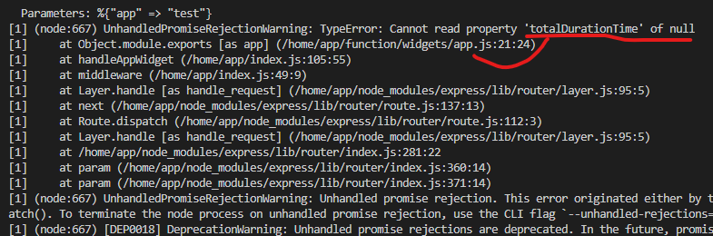
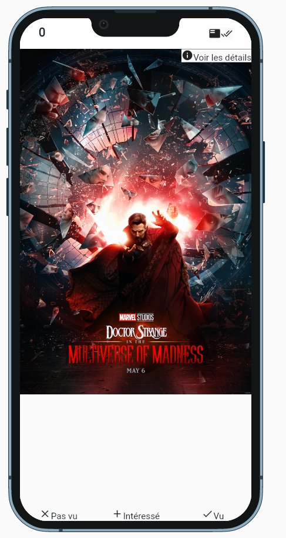
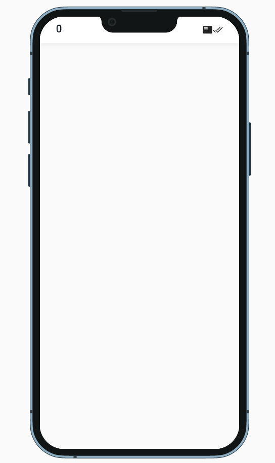
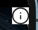
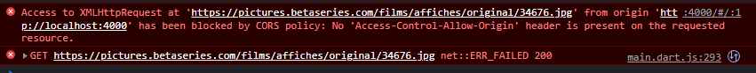
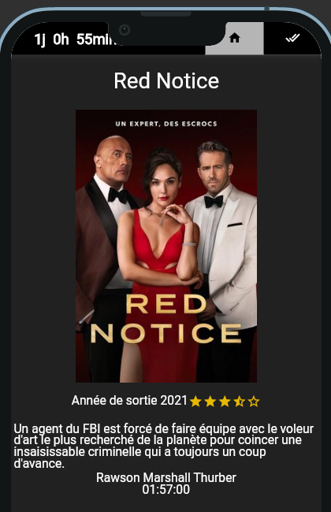
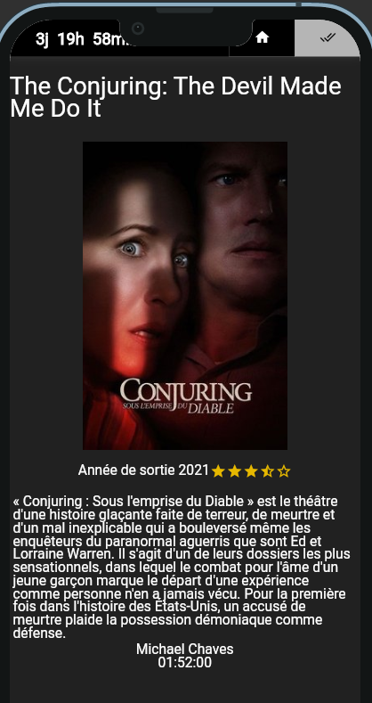
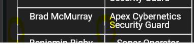

# Rapport problèmes, difficultés d'utilisation, question

<!-- 1. gestion des données : j'ai essayé de créer une variable de type entier mais lorsque je veux accéder à cette données j'ai ce message d'erreur.
```js
'use strict'

module.exports = (data, props, event) => {
  return {
    value: "world",
    totalDurationTime: 0
  }
}
```

Le bout de code qui génère cette erreur est au niveau de value:
```js
{
        type: "flexible",
        child: {
          type: 'text',
          value: props.totalDurationTime
        }
}
``` -->
2. Gestion de fichiers externes (json)
pour l'inclusion d'un fichier en local, il n'est pas spécifié dans la doc comment (pas possible)

3. Pour les éléments `button`, la doc, on n'a pas le terme `action` dans le `onPressed` :
```js
"onPressed": {
            "$ref": "defs/listener.schema.json"
}
```

3. Problème d'affichage des images

4. Concernant la doc ça faciliterai la tâche d'avoir des bouts de code, avec le rendu en image pour voir ce que cela représente.
Par exemple je ne pensais pas que l'élément stack soit utilisé pour superposer des éléments.

5. Pas de doc pour comprendre comment placer les éléments d'une liste ou d'un tableau dans un flex par exemple en utilisant un élément pour y placer chaque item du tableau item.
```js
 return {
    //pour boucler des éléments
    type:"flex",
    direction:"vertical",
    children:[
      ...data.userInterests.forEach(element => {
        return {
          type: "button",
          text: element
        }
      })
    ]
  }
```

6. Pour l'intégration d'îcones, on doit mettre de grandes tailles parceque la taille par défaut(qui est indiqué dans la doc) est minuscule voir invisible.

7. Bouttons -> pas possible de changer le style ?

8. icones sur les boutons -> pas possible de placer uniquement une icone

9. Pour le 7 et le 8 faut utiliser des actionnables

10. Style d'une image, mise en place d'un filtre d'opacité pour mon cas, lorsque l'image est grande et que l'on veut qu'elle prenne toute la place difficultés à la centrer.

11. faire l'équivalent d'un fillParent sur un actionnable.

12. minHeight sur la constraint du conteneur qui efface le contenu




```js
 type: "container",
            constraints: {
              minHeight: 5
    },
```

<!-- 13. erreur commande 
```
Postgresql data directory not found: /var/lib/postgresql/data, creating it...
Postgresql data directory is empty, initializing...
The files belonging to this database system will be owned by user "app".
This user must also own the server process.

The database cluster will be initialized with locale "en_US.utf8".
The default database encoding has accordingly been set to "UTF8".
The default text search configuration will be set to "english".

Data page checksums are disabled.

fixing permissions on existing directory /var/lib/postgresql/data ... ok
creating subdirectories ... ok
selecting dynamic shared memory implementation ... posix
selecting default max_connections ... 100
selecting default shared_buffers ... 128MB
selecting default time zone ... UTC
creating configuration files ... ok
running bootstrap script ... ok
performing post-bootstrap initialization ... sh: locale: not found
2022-04-13 11:27:13.088 UTC [17] WARNING:  no usable system locales were found
ok
syncing data to disk ... ok

initdb: warning: enabling "trust" authentication for local connections
You can change this by editing pg_hba.conf or using the option -A, or
--auth-local and --auth-host, the next time you run initdb.

Success.

Starting Postgresql...
waiting for server to start....2022-04-13 11:27:15.995 GMT [28] LOG:  starting PostgreSQL 13.6 on x86_64-alpine-linux-musl, compiled by gcc (Alpine 10.3.1_git20211027) 10.3.1 20211027, 64-bit
2022-04-13 11:27:15.995 GMT [28] LOG:  listening on IPv4 address "127.0.0.1", port 5432
2022-04-13 11:27:15.995 GMT [28] LOG:  could not bind IPv6 address "::1": Address not available
2022-04-13 11:27:15.995 GMT [28] HINT:  Is another postmaster already running on port 5432? If not, wait a few seconds and retry.
2022-04-13 11:27:16.001 GMT [28] LOG:  listening on Unix socket "/run/postgresql/.s.PGSQL.5432"
2022-04-13 11:27:16.007 GMT [29] LOG:  database system was shut down at 2022-04-13 11:27:13 GMT
2022-04-13 11:27:16.013 GMT [28] LOG:  database system is ready to accept connections
 done
server started
Running init scripts...
CREATE DATABASE
Init done !
2022/04/13 11:27:16 Version: 0.8.4      SHA: bbd2e96214264d6b87cc97745ee9f604776dd80f
2022/04/13 11:27:16 Forking: npm, arguments: [start]
2022/04/13 11:27:16 Started logging: stderr from function.
2022/04/13 11:27:16 Started logging: stdout from function.
2022/04/13 11:27:16 Watchdog mode: http
2022/04/13 11:27:16 Timeouts: read: 15s, write: 15s hard: 10s.
2022/04/13 11:27:16 Listening on port: 8080
2022/04/13 11:27:16 Writing lock-file to: /tmp/.lock
2022/04/13 11:27:16 Metrics listening on port: 8081

> openfaas-node12@1.0.0 start /home/app
> npm run dev:watch
npm ERR!
npm ERR! Failed at the openfaas-node12@1.0.0 dev:watch script.
npm ERR! This is probably not a problem with npm. There is likely additional logging output above.

npm ERR! A complete log of this run can be found in:
npm ERR!     /home/app/.npm/_logs/2022-04-13T11_27_18_735Z-debug.log
npm ERR! code ELIFECYCLE
npm ERR! errno 1
npm ERR! openfaas-node12@1.0.0 start: `npm run dev:watch`
npm ERR! Exit status 1
npm ERR!
npm ERR! Failed at the openfaas-node12@1.0.0 start script.
npm ERR! This is probably not a problem with npm. There is likely additional logging output above.

npm ERR! A complete log of this run can be found in:
npm ERR!     /home/app/.npm/_logs/2022-04-13T11_27_18_762Z-debug.log
2022/04/13 11:27:18 Forked function has terminated: exit status 1
``` -->
 14. gestion des évènement de type hover, pas suffisament de doc pour l'utilisation dans le listener

 15. Dans la doc il est indiqué que pour les padding on doit utiliser des number(int ?) mais on peut placer des flottant.

 16. On ne peut pas rendre invisible le background du actionnable lorsqu'on a une icone de forme ronde et qu'on fait un border radius.
 

 17. On ne peut pas rendre un flex scrollable quand on est dans un autre flex, cas avec flex contenant un menu et un autre sous-flex contenant par exemple les éléments d'une liste.(problème réglé avec un flexible parent au 2ème flex avec la propriété tight ou loose)

 18. On ne sait pas quand on rentre et quitte un hover sur un actionnable, notre actionnable prend
 la couleur du hover quand on clic sur l'actionnable et que dans la nouvelle vue, on ne hover plus le même actionnable (cas du menu qui est présente dans plusieurs vu).

 19. En prenant comme source d'image des urls provenant d'une d'une api, la source de l'image est bloqué.



20. Centrer le texte lorsque que le texte est trop long :



21. Gestion d'affichage conditionnel de widgets (if)

22. Mise en place d'un padding sur un texte en fonction de la taille de l'écran

23. Devtools bouton pour les paramètres par défauts

24. dropdown permettre la personnalisation comme les actionables

25. latence lorsque l'on a beaucoup de films enregistrés dans l'un des tableaux

26. lors du rechargement de la page apres un hover, l'affichage aléatoire de de quelques éléments d'un tableau s'actualise et on peut avoir cet évènement en boucle

27. le hover sur un actionable>menu>dropdown (actionable qui est dans un menu qui est dans une dropdown) ne premet pas de mettre à jour le style de l'actionnable

28. gestion d'affichage de tableau difficile, lorsque l'on aveu afficher un tableau, de 2 colonnes par exemple, et que les éléments de ces colonne ont une taille variables en fonction du contenu, on a un problème quand l'élément de la colonne gauche et plus grand que l'élément de la colonne droite, ex(dans ce cas il y a un prblème d'affichage des lignes, qui se basent sur leur conteneur ) :


29. background d'une vue de scroll non disponible sans ajouter au moins un élément dans la liste à scroll

30. pour l'utilisation des overlay, dans la doc on ne sait pas comment utiliser l'overlay, d'une première intuition je pense qu'il faudrait dupliquer la vue et placer l'overlay sur la copie ?

<!-- 
* clean le code -> fonctions, widgets, commentaires


* ajouter la gestion des séries :
 avec overlay + mode + lors du clic sur ajouter
 gestion du temps si l'utilisateur n'a spas tout vu, ajouter le temps restant dans le temps potentiel a perdre
 * utiliser l'overlay pour les saisons des séries
-->
