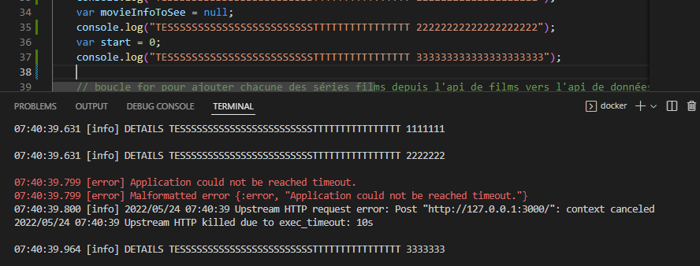

# Rapport V2
1. Gestion des fichiers externes (en local)
2. Avoir des exemples d'utilisation de code dans la doc, avec des screens ? 
3. Valeur par défaut des icones minuscule, avoir une taille par défaut plus élevée
4. Filtre d'opacité pour une image, récupération de la taille
5. minHeight sur la constraint du conteneur qui efface le contenu
6. On ne peut pas rendre invisible le background du actionnable lorsqu'on a une icone de forme ronde et qu'on fait un border radius.
 
 7. On ne sait pas quand on rentre et quitte un hover sur un actionnable
 8. Centrer le texte lorsque que le texte est trop long :


9. dropdown permettre la personnalisation comme les actionables
10. latence 
11. lors du rechargement de la page apres un hover, l'affichage aléatoire de de quelques éléments d'un tableau s'actualise et on peut avoir cet évènement en boucle
12. le hover sur un actionable>menu>dropdown (actionable qui est dans un menu qui est dans une dropdown) ne premet pas de mettre à jour le style de l'actionnable
13. gestion d'affichage de tableau difficile
14. background d'une vue de scroll non disponible
15.  quand ca fait un moment qu'il n'y a aucune interaction avec le devtool des valeurs (tableaux du init data) passent en undefined, et cela se répercute dès qu'un hover est fait sur un bouton par exemple une erreur est générée.
16. slider onChanged agit comme un onChangedEnd (prends la valeur que quand on relache le slider)
17. la contrainte maxWidth efface textfield

## Nouvelle méthode de la gestion des données

1. le fichier counterService.js est propre à chaque appli ?
    > * createDatastore -> créer une collection qui se nome `Counter`.
    > * new -> créer un compteur 
    > * delete -> créer un compteur 
    > * put -> mettre à jour un compteur
    > * get -> récupérer un compteur
```js
'use strict'

const { default: axios } = require("axios");

module.exports = {
    get(api, counterId) {
        return axios.get(`${api.url}/app/datastores/Counter/data/${counterId}`, { headers: { Authorization: `Bearer ${api.token}` } }
        );
    },
    put(api, counter) {
        return axios.put(`${api.url}/app/datastores/Counter/data/${counter._id}`, counter, { headers: { Authorization: `Bearer ${api.token}` } });
    },
    new(api) {
        return axios.post(`${api.url}/app/datastores/Counter/data`, { "value": 0 }, { headers: { Authorization: `Bearer ${api.token}` } });
    },
    delete(api, counterId) {
        return axios.delete(`${api.url}/app/datastores/Counter/data/${counterId}`, { headers: { Authorization: `Bearer ${api.token}` } });

    },
    createDatastore(api) {
        return axios.post(`${api.url}/app/datastores`, { "name": "Counter" }, { headers: { Authorization: `Bearer ${api.token}` } });
    }
}

```

2. Différence entre le onEnvStart et le onSessionStart ?

3. quand on a des erreurs, par exemple ici on ne sait pas d'où viens l'erreur (ligne,fichier)
```
12:29:04.455 [error] Application error (500) TypeError: Cannot read property 'element' of undefined
12:29:04.455 [error] GenServer {:session, "65c20b75-f158-49ad-9c16-05b97b030ad9"} terminating
** (CaseClauseError) no case clause matching: {:error, "Application error (500) TypeError: Cannot read property 'element' of undefined"}
    (application_runner 0.0.0-dev) lib/session/session_manager.ex:194: ApplicationRunner.SessionManager.get_and_build_ui/2
    (application_runner 0.0.0-dev) lib/session/session_manager.ex:131: ApplicationRunner.SessionManager.handle_info/2
    (stdlib 3.17.1) gen_server.erl:695: :gen_server.try_dispatch/4
    (stdlib 3.17.1) gen_server.erl:771: :gen_server.handle_msg/6
    (stdlib 3.17.1) proc_lib.erl:226: :proc_lib.init_p_do_apply/3
Last message: :data_changed
12:29:04.457 [error] GenServer #PID<0.3569.0> terminating
** (CaseClauseError) no case clause matching: {:error, "Application error (500) TypeError: Cannot read property 'element' of undefined"}
    (application_runner 0.0.0-dev) lib/session/session_manager.ex:194: ApplicationRunner.SessionManager.get_and_build_ui/2
    (application_runner 0.0.0-dev) lib/session/session_manager.ex:131: ApplicationRunner.SessionManager.handle_info/2
    (stdlib 3.17.1) gen_server.erl:695: :gen_server.try_dispatch/4
    (stdlib 3.17.1) gen_server.erl:771: :gen_server.handle_msg/6
    (stdlib 3.17.1) proc_lib.erl:226: :proc_lib.init_p_do_apply/3
Last message: {:EXIT, #PID<0.3568.0>, {{:case_clause, {:error, "Application error (500) TypeError: Cannot read property 'element' of undefined"}}, [{ApplicationRunner.SessionManager, :get_and_build_ui, 2, [file: 'lib/session/session_manager.ex', line: 194]}, {ApplicationRunner.SessionManager, :handle_info, 2, [file: 'lib/session/session_manager.ex', line: 131]}, {:gen_server, :try_dispatch, 4, [file: 'gen_server.erl', line: 695]}, {:gen_server, :handle_msg, 6, [file: 'gen_server.erl', line: 771]}, {:proc_lib, :init_p_do_apply, 3, [file: 'proc_lib.erl', line: 226]}]}}
```
4. stack bar qui persiste son affichage pour la meme erreur
5. lors d'un ctrl+c et d'un refresh du devtool, on la la vue d'erreur qui s'affiche et quand on refait un refresh sans rien modifier l'appli fonctionne sans erreur

5. erreur incompréhensible qui survient dans le listener de la vue intermédiaire qui permet de charger et stocker les données en asynchrone (pas possible dans onUserFirstJoin.js)


<!---->